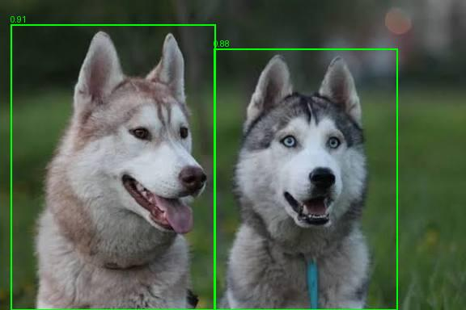
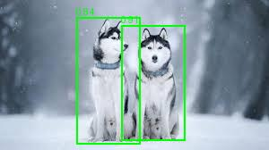
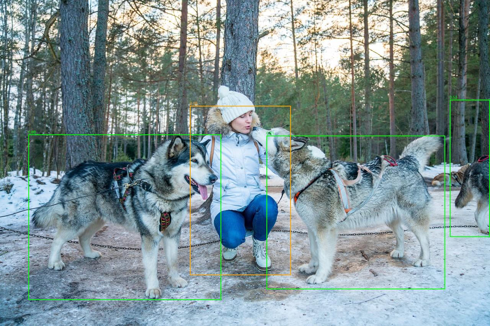

<div align="center">

# Siberian Husky Detection

### VLM Auto-labeling and *Transfer Learning*

**Language:** [Español](README.md) | English

</div>

---

## 1. Introduction

This repository implements an autonomous object detection pipeline specialized for the Siberian Husky breed. The system combines three main components: a vision-language model (Qwen3.5 VL) used to automatically generate training annotations from unlabeled images, a YOLOv8s detector fine-tuned via transfer learning on those annotations, and a cascade validation stage in which the same vision-language model confirms or discards each YOLOv8s detection before reporting it as final.

The pipeline is organized into five phases: (1) auto-labeling of raw images with the VLM, (2) fine-tuning of YOLOv8s on the generated annotations, (3) deployment inference with the trained detector, (4) cascade validation of each detection with the VLM, and (5) computation of evaluation metrics (mAP@0.5, precision, recall, latency, and FPS). All phases are implemented as independent scripts in `src/`, runnable individually or end-to-end via `main.py`.

---

## 2. Hardware Specifications

The results reported in Section 7 were obtained on the following machine:

| Component | Specification |
|:---|:---|
| Operating system | Windows 10 |
| Processor | Intel Core i7-12650HX (12th gen) |
| RAM | 15.7 GB |
| GPU | NVIDIA GeForce RTX 4050 Laptop GPU |
| VRAM | 6.0 GB |
| CUDA | 12.1 |
| PyTorch | 2.5.1+cu121 |
| Python | 3.10.20 (conda-forge) |
| Ultralytics | 8.4.95 |

---

## 3. Repository Structure

```text
husky-detection/
├── main.py                         # Orchestrates the full pipeline (Section 5)
├── config.py                       # Centralized configuration (Section 4)
├── requirements.txt
├── src/
│   ├── utils.py                    # QwenVLM (VLM) and YOLODetector
│   ├── rename_and_resize_images.py # Normalizes raw images
│   ├── auto_labeling.py            # Phase 1: VLM auto-labeling
│   ├── split_dataset.py            # Train/test split + dataset.yaml
│   ├── train_yolo.py               # Phase 2: YOLOv8s fine-tuning
│   ├── hybrid_inference.py         # Phases 3-4: detection + cascade
│   ├── metrics.py                  # Phase 5: IoU, mAP@0.5, P-R curve
│   ├── compare_pr_curves.py        # Combines P-R curves into one figure
│   ├── generate_fixture_dataset.py # Helper, not part of the
│   │                                # pipeline (Section 6.8)
│   └── test_box_order.py           # Helper, not part of the
│                                    # pipeline (Section 6.8)
├── data/
│   ├── raw/          # Original, unlabeled images
│   ├── labels_auto/  # YOLO annotations generated by the VLM
│   ├── labels_check/ # Visualizations for manual review
│   ├── train/, test/ # 70/30 split from split_dataset.py
│   └── validation/   # Additional set reserved as a holdout
├── models/             # Final fine-tuned YOLOv8s weights (deliverable)
├── runs/detect/train/  # Training curves, confusion matrix,
│                       # results.csv
└── results/
    ├── metrics/  # One JSON file per evaluated configuration
    ├── figures/  # Annotated images (green = TP, orange = FP)
    └── graphs/   # Precision-Recall curves
```

---

## 4. Centralized Configuration (`config.py`)

All adjustable pipeline parameters —paths, Qwen model identifiers, prompts, confidence and IoU thresholds, training hyperparameters, and run names— live exclusively in `config.py`, organized by phase. No pipeline script takes command-line arguments: a run's behavior is determined entirely by the values defined in this file before executing it.

This centralization serves two purposes. First, it prevents the same parameter (e.g., the trained YOLO model's path or the Qwen size in use) from having to be kept in sync manually across several scripts, since each one imports it from a single source. Second, it allows a full run to be reproduced or modified by reviewing a single file, without needing to inspect each module's internal logic. In particular:

| Parameter | Purpose |
|:---|:---|
| `QWEN_LABELER` and `QWEN_VALIDATOR` | Independently select which Qwen3.5 size (0.8B, 2B, 4B, or 9B) is used for labeling and for cascade validation. |
| `HYBRID_MODE` | Toggles between `"yolo_only"` (detector only) and `"cascade"` (detector + VLM validation), allowing the different evaluated configurations to be generated without changing code. |
| `YOLO_TRAINED_NAME` | Determines the name under which the trained model is saved in `models/`, so different training runs don't overwrite one another. |
| Hyperparameters and thresholds | Training hyperparameters (`EPOCHS`, `OPTIMIZER`, `LR0`, `FREEZE`, `AUGMENT`, among others) and inference thresholds (`CONF_THRESHOLD`, `IOU_THRESHOLD`, `MAP_IOU_THRESHOLD`) are defined in a single block per phase, documented with the rationale behind each value. |
| `DEVICE` and `DTYPE` | Determine the device (`"cuda"`, `"cpu"`, or `"auto"`) and quantization (`"float32"`, `"float16"`, or `"bfloat16"`) used to load the Qwen models in Phase 1 and Phase 4. |

> **Note:** before running the pipeline on a machine other than the one used for this repository's results, it is recommended to review and adjust `DEVICE`/`DTYPE` according to the available hardware (NVIDIA GPU, CPU, or another compute/VRAM combination), since an incompatible value can prevent the models from loading or significantly degrade performance.

---

## 5. Running the Full Pipeline

Before running the project, it is recommended to create and activate a virtual environment with Python 3.10. From the repository root, dependencies are installed via `requirements.txt`, which includes the libraries required for PyTorch processing, the Qwen and YOLOv8s models, and metrics/visualization generation:

```bash
python -m pip install --upgrade pip
pip install -r requirements.txt
python main.py
```

If the pipeline is run on Kaggle, some dependencies may already be preinstalled in outdated versions. Before starting the pipeline, it is recommended to update the main packages:

```bash
!pip install -U transformers accelerate ultralytics -q
```

Once the installation finishes, the Kaggle session must be restarted to correctly load the updated versions.

`main.py` runs, in order, image renaming/resizing, auto-labeling (Phase 1), dataset splitting, YOLOv8s fine-tuning (Phase 2), and finally hybrid inference (Phases 3-4-5) once per configuration defined in `CONFIGURACIONES_HYBRID` —by default, the three configurations evaluated in this work: YOLOv8s alone, YOLOv8s with Qwen 0.8B cascade validation, and YOLOv8s with Qwen 2.0B cascade validation—. For each configuration, `main.py` automatically adjusts `HYBRID_MODE`/`QWEN_VALIDATOR`/`RUN_LABEL` in `config.py`, runs `hybrid_inference.py`, and restores the file to its original state when finished.

The `FUENTE_ACTIVA` variable, at the top of `main.py`, selects the input image set (`"raw"` for the main dataset, `"validation"` to evaluate on the additional holdout) and adjusts the paths read by each script accordingly.

When run, `main.py` prints an initial summary with the active source, the steps to run, the configurations to evaluate, and the YOLO model's status, and stops at the first step that fails.

---

## 6. Running the Modules Separately

### 6.1 Normalizing the Raw Images

```bash
python src/rename_and_resize_images.py
```

Renames the images in `data/raw/` to the `husky_000.jpg, husky_001.jpg, ...` scheme and resizes (never enlarges) any image exceeding `config.MAX_IMAGE_DIM` on its longest side. It must be run exactly once, before labeling, since renaming after annotations already exist would break the image-to-`.txt` correspondence.

### 6.2 VLM Auto-labeling (Phase 1)

```bash
python src/auto_labeling.py
```

For each image in `data/raw/`, queries Qwen (`config.QWEN_LABELER`) via `config.PROMPT_LABELING`, converts the response to YOLO format, and writes the corresponding annotation in `data/labels_auto/`, along with a visualization with the boxes drawn in `data/labels_check/` for review. When `config.VERIFY_BREED` is enabled, each detected box is cropped and submitted to a second binary query on the same model (`config.PROMPT_VERIFY_BREED`), which confirms whether the region specifically corresponds to a Siberian Husky before keeping it.

### 6.3 Reviewing the Generated Annotations

> [!IMPORTANT]
> It is recommended to visually inspect the contents of `data/labels_check/` before proceeding to training, and to manually correct any annotation in `data/labels_auto/` that does not match its image.

### 6.4 Preparing the Dataset Split

```bash
python src/split_dataset.py
```

Splits the annotated images into 70% training and 30% test (ratio and seed defined in `config.py`), organizes both subsets in the `images/`+`labels/` structure required by Ultralytics, and generates `dataset.yaml`.

### 6.5 YOLOv8s Fine-tuning (Phase 2)

```bash
python src/train_yolo.py
```

Trains YOLOv8s on the dataset generated in the previous step, using the hyperparameters defined in `config.py`, and copies the best checkpoint obtained to `models/<config.YOLO_TRAINED_NAME>`, which is the model used by the rest of the pipeline.

### 6.6 Hybrid Inference and Evaluation (Phases 3-4-5)

```bash
python src/hybrid_inference.py
```

Runs the trained YOLOv8s detector on the evaluation set and, if `config.HYBRID_MODE = "cascade"`, validates each detection with Qwen (`config.QWEN_VALIDATOR`) before keeping it. Computes mAP@0.5, precision, recall, average latency, and real FPS, and saves the result in `results/metrics/`, the annotated images in `results/figures/`, and the corresponding Precision-Recall curve in `results/graphs/`. To obtain the three evaluated configurations, this script is run three times, alternating `HYBRID_MODE` and `QWEN_VALIDATOR` between runs.

### 6.7 Comparing Runs

```bash
python src/compare_pr_curves.py
```

Combines the Precision-Recall curves of the runs listed in `results/metrics/` into a single figure, used to compare the evaluated configurations.

### 6.8 Auxiliary Scripts (not part of the pipeline)

`src/generate_fixture_dataset.py` and `src/test_box_order.py` are not invoked by `main.py` nor by any of the modules above. The first generates a synthetic test dataset, used to validate `split_dataset.py`'s behavior without risking the real data. The second is a verification utility that confirms the order of the coordinates returned by the VLM and the result of `convert_to_yolo`, drawing both interpretations on sample images.

---

## 7. Results

### 7.1 Detector Training

YOLOv8s was fine-tuned on the training set (70 images) for 100 epochs, reaching, in the last one, a precision of 0.9153, a recall of 0.9000, and a mAP@0.5 of 0.9584 on the test set (30 images, 60 husky instances).

<p align="center">
  
</p>

<p align="center">
  
</p>

### 7.2 Comparison of the Evaluated Configurations

The following table summarizes the metrics obtained by the three configurations on the test set (30 images, 60 husky instances):

| Configuration | mAP@0.5 | Precision | Recall | False Positives | False Negatives | Avg. Latency (ms) | FPS |
|:---|---:|---:|---:|---:|---:|---:|---:|
| YOLOv8s alone | 0.9350 | 0.4754 | 0.9667 | 64 | 2 | 23.41   | 42.72 |
| YOLOv8s + Qwen 0.8B (cascade) | 0.9376 | 0.6706 | 0.9500 | 28 | 3 | 2198.84 | 0.45 |
| YOLOv8s + Qwen 2.0B (cascade) | 0.9549 | 0.6667 | 0.9667 | 29 | 2 | 2328.17 | 0.43 |

Adding cascade validation substantially reduces the number of false positives compared to the standalone detector, at the cost of a considerable increase in per-image latency, inherent to running an additional query to the vision-language model for each detection.

<p align="center">
  
</p>

<table>
<tr>
<td></td>
<td></td>
<td></td>
</tr>
</table>

### 7.3 Visual Detection Results

The following shows the result of the three configurations on the same test-set images (green: true positive, orange: false positive). The orange boxes present in the YOLOv8s-alone column correspond to detector false positives; their absence in the cascade columns evidences the effect of VLM validation on those same detections. In the last example (`husky_029.jpg`), a progressive reduction can also be observed: Qwen 0.8B removes some of the false positives detected by YOLOv8s, and Qwen 2.0B additionally removes the ones 0.8B did not discard.

<table>
<tr>
<td align="center">YOLOv8s alone</td>
<td align="center">+ Qwen 0.8B</td>
<td align="center">+ Qwen 2.0B</td>
</tr>
<tr>
<td></td>
<td></td>
<td></td>
</tr>
<tr>
<td></td>
<td></td>
<td></td>
</tr>
<tr>
<td></td>
<td></td>
<td></td>
</tr>
<tr>
<td></td>
<td></td>
<td></td>
</tr>
</table>
