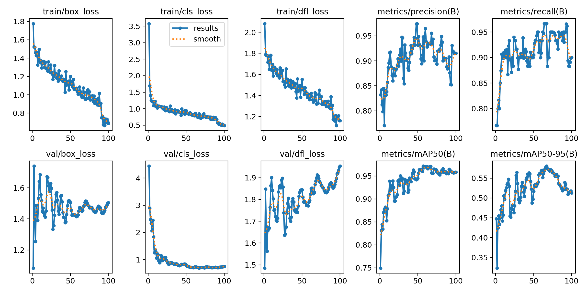
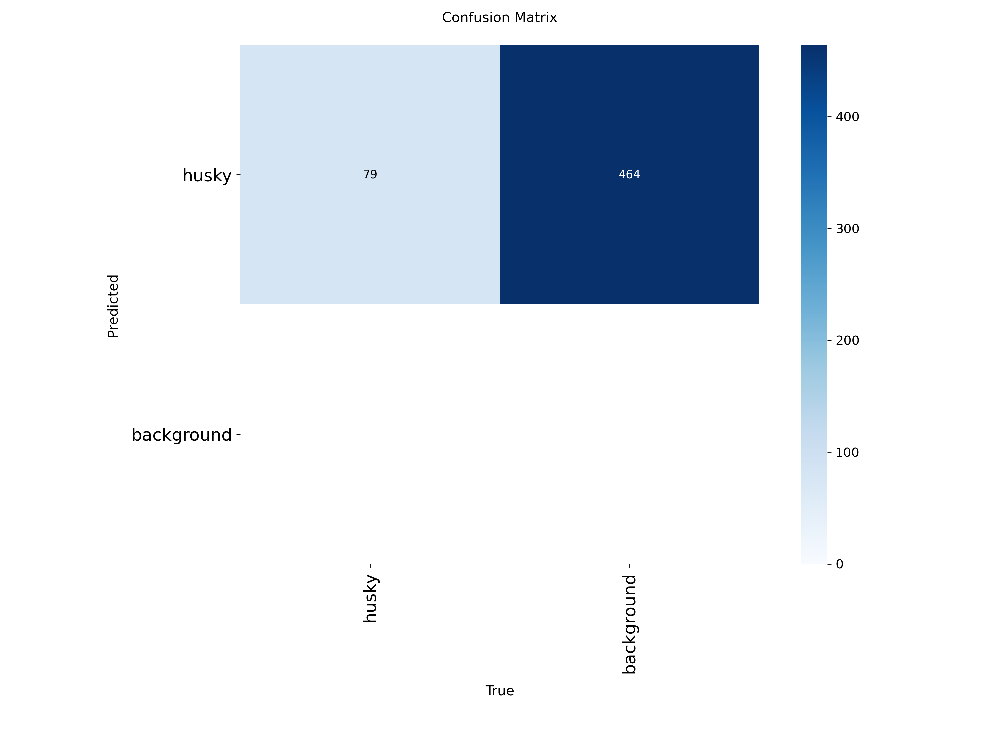
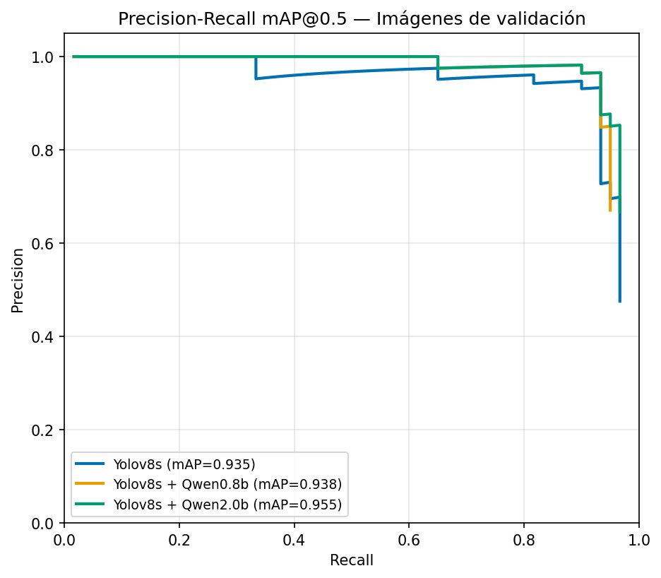
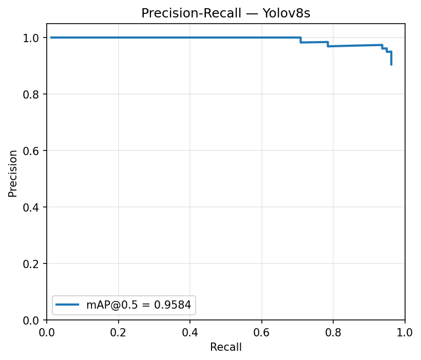
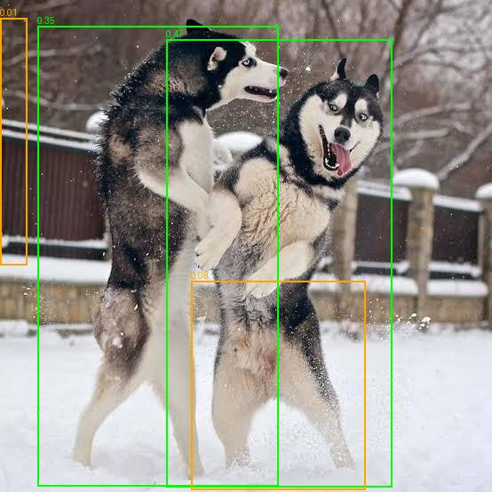

# Detección de Huskies Siberianos: auto-etiquetado con VLM y transfer learning


## 1. Introducción

Este repositorio implementa un pipeline autónomo de detección de objetos especializado en la raza Husky Siberiano. El sistema combina tres componentes principales: un modelo de lenguaje visual (Qwen3.5 VL) empleado para generar automáticamente las anotaciones de entrenamiento a partir de imágenes sin etiquetar, un detector YOLOv8s ajustado mediante transfer learning sobre esas anotaciones, y una etapa de validación en cascada en la que el mismo modelo de lenguaje visual confirma o descarta cada detección del YOLOv8s antes de reportarla como definitiva.

El pipeline se organiza en cinco fases: (1) auto-etiquetado de las imágenes crudas mediante el VLM, (2) ajuste fino de YOLOv8s sobre las anotaciones generadas, (3) inferencia en despliegue con el detector entrenado, (4) validación en cascada de cada detección con el VLM, y (5) cálculo de métricas de evaluación (mAP@0.5, precisión, recall, latencia y FPS). Todas las fases están implementadas como scripts independientes en `src/`, orquestables individualmente o de punta a punta mediante `main.py`.

## 2. Especificaciones del equipo de cómputo

Los resultados reportados en la Sección 7 se obtuvieron en el siguiente equipo:

| Componente | Especificación |
|---|---|
| Sistema operativo | Windows 10 |
| Procesador | Intel Core i7-12650HX (12.ª generación) |
| RAM | 15.7 GB |
| GPU | NVIDIA GeForce RTX 4050 Laptop GPU |
| VRAM | 6.0 GB |
| CUDA | 12.1 |
| PyTorch | 2.5.1+cu121 |
| Python | 3.10.20 (conda-forge) |
| Ultralytics | 8.4.95 |

## 3. Estructura del repositorio

```text
husky-detection/
├── main.py                # Orquesta el pipeline completo (Sección 5)
├── config.py               # Configuración centralizada (Sección 4)
├── requirements.txt
├── src/
│   ├── utils.py                    # QwenVLM (VLM) y YOLODetector
│   ├── rename_and_resize_images.py # Normaliza imágenes crudas
│   ├── auto_labeling.py            # Fase 1: auto-etiquetado con VLM
│   ├── split_dataset.py            # Split train/test + dataset.yaml
│   ├── train_yolo.py               # Fase 2: ajuste fino de YOLOv8s
│   ├── hybrid_inference.py         # Fases 3-4: detección + cascada
│   ├── metrics.py                  # Fase 5: IoU, mAP@0.5, curva P-R
│   ├── compare_pr_curves.py        # Compara curvas P-R en una figura
│   ├── generate_fixture_dataset.py # Auxiliar, no forma parte del
│   │                                # pipeline (Sección 6.8)
│   └── test_box_order.py           # Auxiliar, no forma parte del
│                                    # pipeline (Sección 6.8)
├── data/
│   ├── raw/          # Imágenes originales, sin anotar
│   ├── labels_auto/  # Anotaciones YOLO generadas por el VLM
│   ├── labels_check/ # Visualizaciones para revisión manual
│   ├── train/, test/ # Partición 70/30 de split_dataset.py
│   └── validation/   # Conjunto adicional reservado como holdout
├── models/             # Pesos finales de YOLOv8s ajustado (entregable)
├── runs/detect/train/  # Curvas de entrenamiento, matriz de
│                       # confusión, results.csv
└── results/
    ├── metrics/  # Un JSON por configuración evaluada
    ├── figures/  # Imágenes anotadas (verde = TP, naranja = FP)
    └── graphs/   # Curvas Precision-Recall
```

## 4. Configuración centralizada (`config.py`)

Todos los parámetros ajustables del pipeline —rutas, identificadores de los modelos de Qwen, prompts, umbrales de confianza e IoU, hiperparámetros de entrenamiento y nombres de las corridas— residen exclusivamente en `config.py`, organizado por fase. Ningún script del pipeline recibe argumentos de línea de comandos: el comportamiento de una corrida se determina por completo mediante los valores definidos en este archivo antes de ejecutarlo.

Esta centralización tiene dos propósitos. Primero, evita que un mismo parámetro (por ejemplo, la ruta del modelo YOLO entrenado o el tamaño de Qwen empleado) deba mantenerse sincronizado manualmente entre varios scripts, ya que cada uno lo importa desde una única fuente. Segundo, permite reproducir o modificar una corrida completa revisando un solo archivo, sin necesidad de inspeccionar la lógica interna de cada módulo. En particular:

- `QWEN_LABELER` y `QWEN_VALIDATOR` seleccionan, independientemente, qué tamaño de Qwen3.5 (0.8B, 2B, 4B o 9B) se usa para etiquetar y para validar en cascada.
- `HYBRID_MODE` alterna entre `"yolo_only"` (solo el detector) y `"cascade"` (detector + validación VLM), lo que permite generar las distintas configuraciones evaluadas sin modificar código.
- `YOLO_TRAINED_NAME` determina bajo qué nombre se guarda el modelo entrenado en `models/`, de forma que distintas corridas de entrenamiento no se sobrescriban entre sí.
- Los hiperparámetros de entrenamiento (`EPOCHS`, `OPTIMIZER`, `LR0`, `FREEZE`, `AUGMENT`, entre otros) y los umbrales de inferencia (`CONF_THRESHOLD`, `IOU_THRESHOLD`, `MAP_IOU_THRESHOLD`) se definen en un único bloque por fase, documentado con el criterio empleado para cada valor.

## 5. Ejecución del pipeline completo

```bash
pip install -r requirements.txt
python main.py
```

`main.py` ejecuta en orden el renombrado/redimensionado de imágenes, el auto-etiquetado (Fase 1), la partición del dataset, el ajuste fino de YOLOv8s (Fase 2) y, finalmente, la inferencia híbrida (Fases 3-4-5) una vez por cada configuración definida en `CONFIGURACIONES_HYBRID` —por defecto, las tres configuraciones evaluadas en este trabajo: YOLOv8s solo, YOLOv8s con validación en cascada de Qwen 0.8B, y YOLOv8s con validación en cascada de Qwen 2.0B—. Para cada configuración, `main.py` ajusta automáticamente `HYBRID_MODE`/`QWEN_VALIDATOR`/`RUN_LABEL` en `config.py`, ejecuta `hybrid_inference.py` y restaura el archivo a su estado original al finalizar.

La variable `FUENTE_ACTIVA`, al inicio de `main.py`, selecciona el conjunto de imágenes de entrada (`"raw"` para el dataset principal, `"validation"` para evaluar sobre el holdout adicional) y ajusta en consecuencia las rutas leídas por cada script.

Al ejecutarse, `main.py` imprime un resumen inicial con la fuente activa, los pasos a correr, las configuraciones a evaluar y el estado del modelo YOLO, y detiene la ejecución en el primer paso que falle.

## 6. Ejecución de los módulos por separado

**6.1 Normalización de las imágenes crudas**
```bash
python src/rename_and_resize_images.py
```
Renombra las imágenes de `data/raw/` al esquema `husky_000.jpg, husky_001.jpg, ...` y redimensiona (sin ampliar) cualquier imagen que exceda `config.MAX_IMAGE_DIM` en su lado más largo. Debe ejecutarse una única vez, antes del etiquetado, ya que un renombrado posterior a la generación de etiquetas rompería la correspondencia entre cada imagen y su anotación.

**6.2 Auto-etiquetado con el VLM (Fase 1)**
```bash
python src/auto_labeling.py
```
Para cada imagen de `data/raw/`, consulta a Qwen (`config.QWEN_LABELER`) mediante `config.PROMPT_LABELING`, convierte la respuesta al formato YOLO y escribe la anotación correspondiente en `data/labels_auto/`, además de una visualización con las cajas dibujadas en `data/labels_check/` para su revisión. Cuando `config.VERIFY_BREED` está activo, cada caja detectada se somete a una segunda consulta binaria al mismo modelo (`config.PROMPT_VERIFY_BREED`), que confirma si la región corresponde específicamente a un Husky Siberiano antes de conservarla.

**6.3 Revisión de las anotaciones generadas**

Se recomienda inspeccionar visualmente el contenido de `data/labels_check/` antes de continuar con el entrenamiento, y corregir manualmente cualquier anotación de `data/labels_auto/` que no corresponda con la imagen.

**6.4 Partición del dataset**
```bash
python src/split_dataset.py
```
Separa las imágenes anotadas en un 70 % de entrenamiento y un 30 % de prueba (proporción y semilla definidas en `config.py`), organiza ambos subconjuntos en la estructura `images/`+`labels/` requerida por Ultralytics, y genera `dataset.yaml`.

**6.5 Ajuste fino de YOLOv8s (Fase 2)**
```bash
python src/train_yolo.py
```
Entrena YOLOv8s sobre el dataset generado en el paso anterior, con los hiperparámetros definidos en `config.py`, y copia el mejor punto de control obtenido a `models/<config.YOLO_TRAINED_NAME>`, que es el modelo empleado por el resto del pipeline.

**6.6 Inferencia híbrida y evaluación (Fases 3-4-5)**
```bash
python src/hybrid_inference.py
```
Ejecuta el detector YOLOv8s entrenado sobre el conjunto de evaluación y, si `config.HYBRID_MODE = "cascade"`, valida cada detección con Qwen (`config.QWEN_VALIDATOR`) antes de conservarla. Calcula mAP@0.5, precisión, recall, latencia promedio y FPS reales, y guarda el resultado en `results/metrics/`, las imágenes anotadas en `results/figures/` y la curva Precision-Recall correspondiente en `results/graphs/`. Para obtener las tres configuraciones evaluadas, este script se ejecuta tres veces, alternando `HYBRID_MODE` y `QWEN_VALIDATOR` entre corridas.

**6.7 Comparación de corridas**
```bash
python src/compare_pr_curves.py
```
Combina las curvas Precision-Recall de las corridas indicadas en `results/metrics/` sobre una misma figura, empleada para comparar las configuraciones evaluadas.

**6.8 Scripts auxiliares (no forman parte del pipeline)**

`src/generate_fixture_dataset.py` y `src/test_box_order.py` no son invocados por `main.py` ni por ninguno de los módulos anteriores. El primero genera un dataset sintético de prueba, empleado para validar el funcionamiento de `split_dataset.py` sin arriesgar los datos reales. El segundo es una utilidad de verificación que confirma el orden de las coordenadas devueltas por el VLM y el resultado de `convert_to_yolo`, dibujando ambas interpretaciones sobre imágenes de muestra.

## 7. Resultados

### 7.1 Entrenamiento del detector

YOLOv8s fue ajustado sobre el conjunto de entrenamiento (70 imágenes) durante 100 épocas, alcanzando en la última de ellas una precisión de 0.9153, un recall de 0.9000 y un mAP@0.5 de 0.9584 sobre el conjunto de prueba (30 imágenes, 60 instancias de husky).

<p align="center">
  
</p>

<p align="center">
  
</p>

### 7.2 Comparación de las configuraciones evaluadas

La siguiente tabla resume las métricas obtenidas por las tres configuraciones sobre el conjunto de prueba (30 imágenes, 60 instancias de husky):

| Configuración | mAP@0.5 | Precisión | Recall | Falsos positivos | Falsos negativos | Latencia promedio (ms) | FPS |
|---|---|---|---|---|---|---|---|
| YOLOv8s solo | 0.9350 | 0.4754 | 0.9667 | 64 | 2 | 23.41 | 42.72 |
| YOLOv8s + Qwen 0.8B (cascada) | 0.9376 | 0.6706 | 0.9500 | 28 | 3 | 2198.84 | 0.45 |
| YOLOv8s + Qwen 2.0B (cascada) | 0.9549 | 0.6667 | 0.9667 | 29 | 2 | 2328.17 | 0.43 |

La incorporación de la validación en cascada reduce sustancialmente el número de falsos positivos respecto al detector aislado, a costa de un incremento considerable en la latencia por imagen, propio de ejecutar una consulta adicional al modelo de lenguaje visual por cada detección.

<p align="center">
  
</p>

<table>
<tr>
<td></td>
<td></td>
<td></td>
</tr>
</table>

### 7.3 Resultados visuales de detección

A continuación se muestra el resultado de las tres configuraciones sobre una misma imagen del conjunto de prueba (verde: verdadero positivo, naranja: falso positivo):

<table>
<tr>
<td align="center">YOLOv8s solo</td>
<td align="center">+ Qwen 0.8B</td>
<td align="center">+ Qwen 2.0B</td>
</tr>
<tr>
<td></td>
<td></td>
<td></td>
</tr>
</table>
